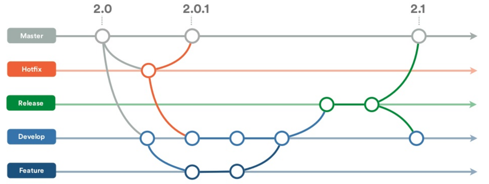

# Git Flow 

The Git Flow is one of the many strategies that can be used for branching and feature development.
The diagram below shows how the Git Flow generally works. 

1. The master branch is used for production release and is used to merge the final code that needs
   to go to production. The master branches are also used to create hot fix branches that are
directly merged into the master for immediate testing and roll out to production.  
2. The development branch is used as in integration branch where all the features developed will be
   merged and tested. 
3. The feature branches are the ones where we have the actual features developed and then merged
   into development for integration testing. 

